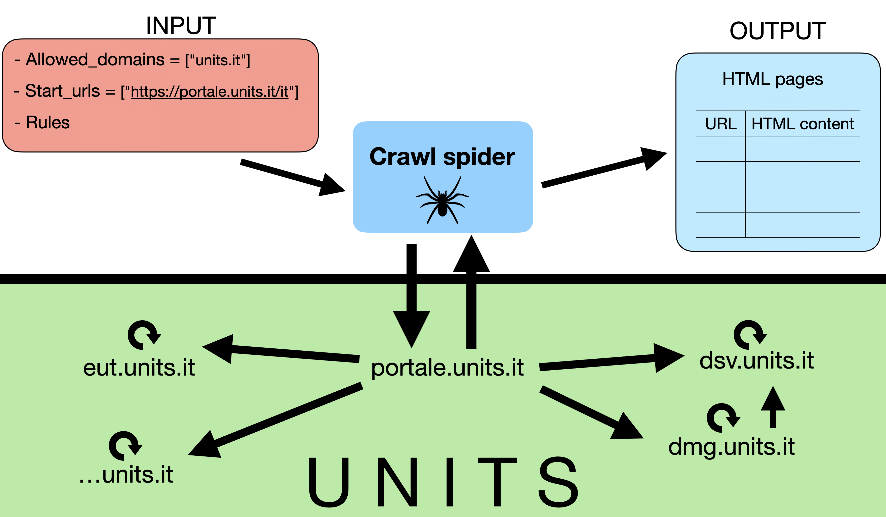

# UniTS MD Crawler

A Scrapy-based web crawler for downloading and processing HTML pages from the University of Trieste (UniTS) website (`units.it`).

---

## Project Structure

```
units_md_crawler/
├── pipeline_scraping.sh        # Main pipeline script
├── requirements.txt
├── scrapy.cfg
├── results/                    # Output directory (generated at runtime)
├── scripts/                    # Post-processing scripts
│   ├── pages_cleaner.py        # Filters and cleans scraped pages
│   └── domains_numbers.py      # Analyzes domain distribution in results
└── units_crawler/              # Scrapy project package
    ├── settings.py
    ├── items.py
    ├── pipelines.py
    ├── middlewares.py
    ├── deny_lists.py
    ├── multilingual_page_filtering.py
    ├── scraper_rules.txt
    ├── utils.py
    └── spiders/
        └── units_global_crawler.py   # Main spider
```

---

## Spider

The spider `units_global_crawler` crawls all pages under `portale.units.it/it`, following internal links recursively up to a configurable depth limit.

For each page it yields:

| Field | Description |
|---|---|
| `title` | Page title |
| `url` | Page URL |
| `description` | Meta description |
| `timestamp` | Crawl date |
| `content` | Raw HTML |

### Optional features

- **User-Agent rotation** — randomly picks a User-Agent from a list on each request, enabled via `-s ROTARY_USER_AGENT=True`
- **Selective proxy** — routes a configurable percentage of requests through a proxy, controlled by `PROXY_RATE` in `.env`
- **PDF link collection** — collects all PDF links found during crawling into a separate file, enabled via `-a scrape_pdf=True`
- **Save individual HTML files** — saves each page as a separate file, enabled via `-a save_each_file=True`

### Multilingual deduplication

UniTS uses Drupal, which serves the same content at multiple URLs differing only by language (subdomain, path segment, query parameter, or fragment). A custom `DupeFilter` (`UnitsLinguisticDupeFilter`) normalizes URLs to a canonical form before fingerprinting, avoiding redundant downloads. Coverage is partial due to Drupal's inconsistent URL patterns.



---

## Post-processing Scripts

### `scripts/pages_cleaner.py`

Cleans and converts raw scraped HTML pages to Markdown. Reads `.jsonl` files produced by the spider (either a single file or a directory of files) and writes a filtered `.jsonl` where `content` is replaced with cleaned Markdown text.

**Extraction strategy:**
- For **Drupal pages** — whitelist extraction targeting the `node__content` region via a chain of XPath selectors. Strips navigation, sidebars, cookies banners, and other Drupal chrome.
- For **non-Drupal pages** — blacklist strategy removing known structural elements (header, footer, navbar, etc.) by class and ID.
- In both cases, noise tags (`script`, `style`, `img`, …) are removed first, then `html2text` converts the result to Markdown.

Pages that produce no meaningful text after cleaning are discarded.

Processing is parallelized with `ProcessPoolExecutor` (up to 8 workers).

```bash
python3 scripts/pages_cleaner.py \
    --input  results/scraper_results_4/ \
    --output results/filtered_items_4.jsonl \
    --verbose
```

| Argument | Description |
|---|---|
| `--input` | Input `.jsonl` file or directory of `.jsonl` files |
| `--output` | Output `.jsonl` file |
| `--verbose` | Print each saved URL |

Set `SAVE_DEBUG_FILES = True` in the script to also save intermediate HTML and Markdown files for inspection.

---

### `scripts/domains_numbers.py`

Analyzes the list of crawled URLs (produced by the spider as `links_list_{depth}.txt`) and generates a domain frequency report plus a multilingual duplication analysis.

**Output** (`summary_domains_numbers_{depth}.txt`):
- Count of URLs per domain, sorted by frequency
- Number of exact duplicate URLs
- Groups of URLs that point to the same page in different languages (e.g. `/it/page` vs `/en/page`), detected via path prefix normalization

```bash
python3 scripts/domains_numbers.py --depth 4 --dir results/
```

| Argument | Description |
|---|---|
| `-d` / `--depth` | Depth limit (used to locate the correct input/output files) |
| `--dir` | Directory containing `links_list_{depth}.txt` (default: `../results_scrapy/`) |

---

## Pipeline

Run the full pipeline with:

```bash
./pipeline_scraping.sh
./pipeline_scraping.sh --depth 6
```

The pipeline:
1. Creates/activates the virtual environment
2. Cleans previous results for the given depth
3. Runs the Scrapy crawler
4. Runs `domains_numbers.py` — domain distribution analysis
5. Runs `pages_cleaner.py` — filters and cleans the scraped pages

---

## Configuration

### Depth limit

Controlled via `--depth` / `-d` argument (default: `4`).

### Proxy

Create a `.env` file in the project root:

```env
SCRAPY_PROXY_URL=http://your-proxy:port
SCRAPY_PROXY_USER=username
SCRAPY_PROXY_PASS=password
SCRAPY_PROXY_RATE=0.5   # fraction of requests routed through proxy (0.0 to 1.0)
```

Set `USE_PROXY = True` in `settings.py` to enable it.

---

## Installation

```bash
python3 -m venv env
source env/bin/activate
pip install -r requirements.txt
```

Or just run `./pipeline_scraping.sh` — it handles environment creation automatically.